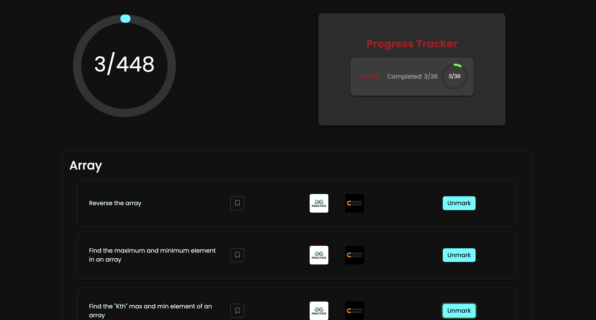

## 📌 Description
CodeQuest is your ultimate DSA (Data Structures & Algorithms) tracker and code optimizer, designed to streamline your coding journey. It offers a curated collection of coding questions across all important topics, along with related videos to help you grasp concepts effectively.

### 🔥 Key Features:  
- ✅ **DSA Tracker** – Keep track of your progress across various topics  
- ✅ **Code Optimizer** – Improve your code efficiency with best practices  
- ✅ **Curated Coding Questions** – Handpicked problems from beginner to advanced levels  
- ✅ **Conceptual Videos** – Learn and understand through high-quality explanations  
- ✅ **Structured Learning Path** – Follow a step-by-step roadmap for mastering DSA  

Whether you're preparing for coding interviews or sharpening your problem-solving skills, CodeQuest is your go-to platform!

## 📸 Snapshots

**HomePage :**


**TopicsPart :**


**QuestionsPage :**


**Tutorials :**


**CodeOptimizer :**


**ProgressTracker :**




## 🚀 Installation & Setup
Clone the repository and install dependencies:

```bash
git clone https://github.com/your-username/your-repo.git
cd your-repo
npm install
npm start
